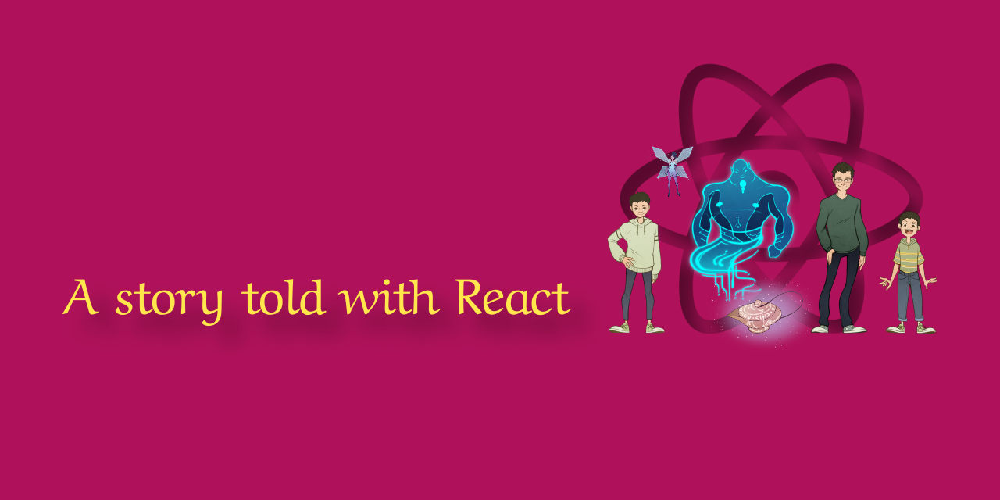

# jamesabels.net

## About

This is my personal Web site. 

It includes a few of my software projects, some of my writing, and a whole lot of my spirit. It also includes seven high-quality, full-page illustrations, a children's book for adults, a hidden magic spell, and a personal blog. 

Here's the full story behind it: [The Magic Leap that lead to a creative’s code](www.google.com).

#### Technical details

This site does not use any blog templates, frameworks, or themes.

It was made with ♥️ in N.Y.C. using React, React Router, and Styled Components. 

The code's entry point is [index.js](https://github.com/abelsj60/jamesabels.net/blob/master/app/index.js). Control logic lives in [React components](https://github.com/abelsj60/jamesabels.net/tree/master/app) and traditional [classes](https://github.com/abelsj60/jamesabels.net/tree/master/app/classes), which are used to determine location and handle many user events. Site data is in [/data](https://github.com/abelsj60/jamesabels.net/tree/master/app/data), media assets in [/docs](https://github.com/abelsj60/jamesabels.net/tree/master/docs), and a dev server in [/server](https://github.com/abelsj60/jamesabels.net/tree/master/server).

hello@jamesabels.net

---

© 2019, James Abels LLC. All rights reserved.